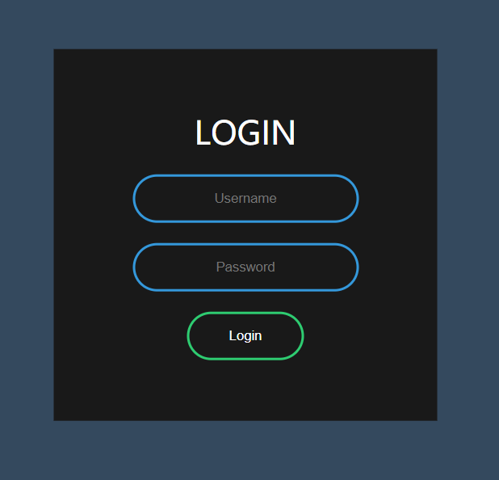

<iframe frameborder="no" border="0" marginwidth="0" marginheight="0" width=330 height=86 src="../music/Always.mp3"></iframe>
   
闲话不多说,我们开始吧!  
1. 搭建HTML结构:  

	  
	
2. 接着开始写CSS样式:  
初始化body:  
``````css
body{
    margin: 0;
    padding: 0;
    font-family: sans-serif;
    background: #34495e;
}

.box{
    width: 300px;
    padding: 40px;
    position: absolute;
    top: 50%;
    left: 50%;
    transform: translate(-50%,-50%);
    background: #191919;
    text-align: center;
}
```
```css
.box h1{
    color: white;
    text-transform: uppercase;
    font-weight: 500;
}
  .box input[type = "text"],.box input[type = "password"]{
    border: 0;
    background: none;
    display: block;
    margin: 20px auto;
    text-align: center;
    border: 2px solid #3498db;
    padding: 14px 10px;
    width: 200px;
    outline: none;
    color: white;
    border-radius: 24px;
    transition: 0.25s;
}
.box input[type = "text"]:focus,.box input[type = "password"]:focus{
    width: 280px;
    border-color: #2ecc71;
}
.box input[type = "submit"]{
    border: 0;
    background: none;
    display: block;
    margin: 20px auto;
    text-align: center;
    border: 2px solid #2ecc71;
    padding: 14px 40px;
    outline: none;
    color: white;
    border-radius: 24px;
    transition: 0.25s;
    cursor: pointer;
}
.box input[type = "submit"]:hover{
    background: #2ecc71;
}
```


本文参考:YouTube(DarkCode)
